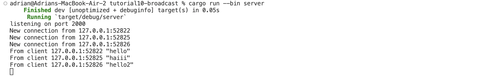
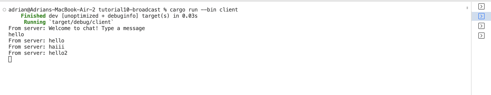
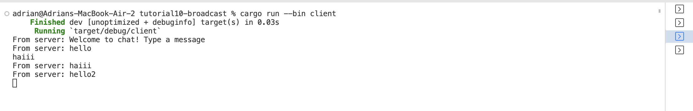
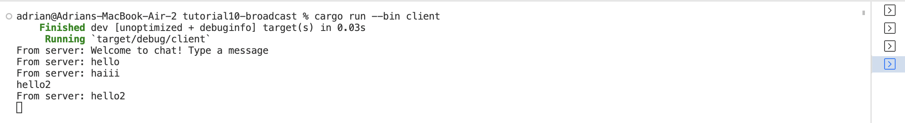

#### Nama : Adrian Aryaputra Hamzah
#### NPM : 2206811474
#### Kelas : ADPRO - B
#### ASDOS : GEN

 # 2.1. Original code of broadcast chat

Untuk melakukan run pada server dapat dengan `cargo run --bin server` sedangkan untuk run client `cargo run --bin client`

Berdasarkan output yang dihasilkan, pada awalnya, setiap client yang run akan langsung terhubung kepada server; ketika kita mengirimkan pesan dari satu klien, maka setiap klien dan server akan menerima pesan tersebut.

Setiapkali klien memasukan pesan melalui baris perintah, pesan tersebut akan langsung dikirim ke server; server akan menerukan ke seluruh klien yang terhubung.
