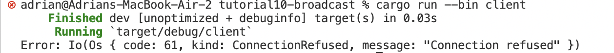
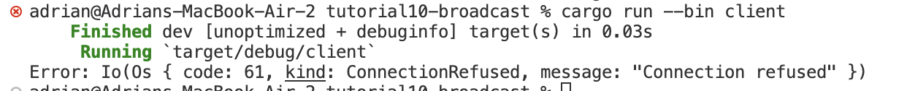
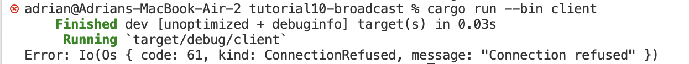
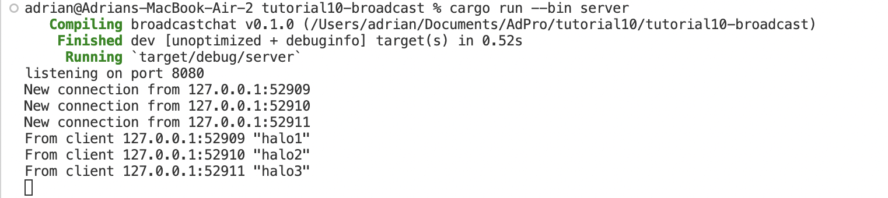
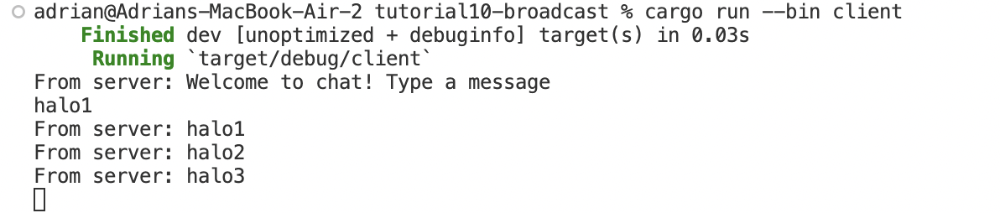
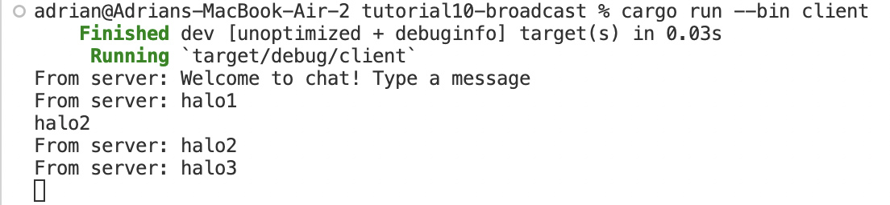
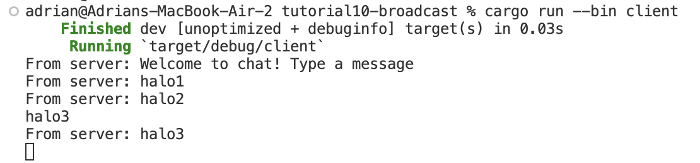

#### Nama : Adrian Aryaputra Hamzah
#### NPM : 2206811474
#### Kelas : ADPRO - B
#### ASDOS : GEN

# 2.1. Original code of broadcast chat

Untuk melakukan run pada server dapat dengan `cargo run --bin server` sedangkan untuk run client `cargo run --bin client`

Berdasarkan output yang dihasilkan, pada awalnya, setiap client yang run akan langsung terhubung kepada server; ketika kita mengirimkan pesan dari satu klien, maka setiap klien dan server akan menerima pesan tersebut.

Setiapkali klien memasukan pesan melalui baris perintah, pesan tersebut akan langsung dikirim ke server; server akan menerukan ke seluruh klien yang terhubung.

# 2.2: Modifying port

Gambar pertama menunjukkan server dan klien dengan port yang berbeda (server di port 2000, klien di port 8080), yang menyebabkan ketidakcocokan sehingga koneksi antara keduanya gagal.

Gambar kedua memperlihatkan kondisi ketika klien dan server menggunakan port yang sama, yaitu 8080. Dengan kesesuaian ini, koneksi antara klien dan server berhasil. Ini menegaskan bahwa jika port klien diubah, maka port server juga harus disesuaikan karena komunikasi antara server dan klien memerlukan keselarasan dua arah.
